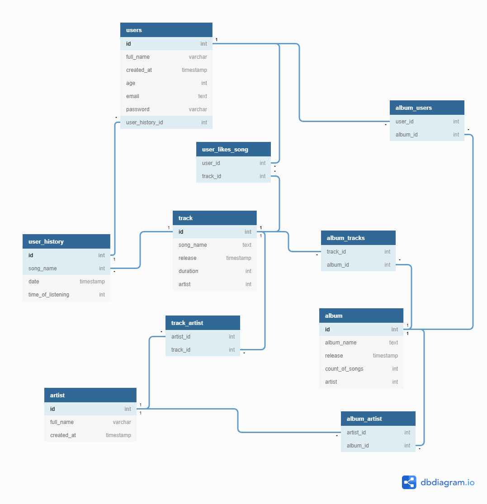

### 1. Выбор темы
* Spotify (музыкальный сервис)

### 2. Определение возможного диапазона нагрузок

* Месячная аудитория 15 млн

* Дневная аудитория 1.9 млн

* Пользователи в среднем слушают музыку ~90 минут в день

### 3. Выбор планируемой нагрузки

В силу того, что Spotify недавно начал свою деятельность на территории России, где уже работают крупные конкуренты, а также высокого уровня популярности 
сервиса в том числе в России, можно оценить планируемую нагрузку как 30% доля рынка в России.

За час прослушивания музыки расходуется 85Mb трафика. Дневная аудитория 1.9 млн * 90 (минут) / 60 (час) * 85 (Mb) --> 242 Tb -- _дневная нагрузка_.

242 Tb * 8 / 864000 = 22.4 Гб/c

242 * 1014 Гб * 8 / 86400 = 22.8 гбит/c.

### 4. Логическая схема базы данных (без выбора СУБД)


### 5. Физическая системы хранения (конкретные СУБД, шардинг, расчет нагрузки, обоснование реализуемости на основе результатов нагрузочного тестирования)

Основные дейсвия это скачивание и прослушивание музыки. Поэтому расчитаем rps на отдачу.

``` 
1 900 0000 активных пользователей
x
90 минут
/
24 часа x 60 минут x 60 сек
------------------------------------------
~ 2 000 RPS
``` 
С такой нагрузкой справится 1 сервер PostgreSQL, однако для нашего проекта будем ориентироваться на использование кластера. Помимо того, 
понадобятся кэширующие сервисы - например, memcached, т.к специфика сервиса подразумевает неоднократное обращение к одним и тем же ресурсам поиска или 
метаданных. 

Аудио/фото контент целесообразно хранить в Amazon S3 с точки зрения цены/качества. Вспомогательный кэш для этих ресурсов подразумевается на 
наших бэкендах. Можно было бы воспользоваться Amazon CloudFront для решения этой проблемы, однако его нет в России.
Естественно речь идет о разработке SPA приложения на фронте, поэтому следует учесть использование методов/технологий минимизации 
скриптов и стилей.

Также следует предусмотреть большое количество записей пользователей о содержимом их библиотеки. Из схемы бд следует, что для хранения музыки пользователя потребуется 8 байт. Тогда, учитывая запас:

128 * 1024^3 (байты) * 0.5 / (8 * 200 (среднее кол-во песен у пользователя)) = 43 000 000 (хранение записей пользователей)

Дополнительных приемов для устройства структуры БД не требуется, т.к. ко всем данным доступ одинаковый.

### 6. Выбор прочих технологий: языки программирования, фреймфорки, протоколы взаимодействия, веб-сервера и т.д. (с обоcнованием выбора)

_web client_: JavaScript.

_backend_: Можно воспользоваться HAproxy.У Haproxy есть возможность указать dns resolvers (resolver обращается к локальному серверу имен) 
и настроить dns cache. Тем самым Haproxy будет сам обновлять dns cache, если записи в нем 
истекли, и заменять адреса для апстримов в том случае, если они изменились.

Язык бэкенда Golang, потому что зарекомендовал себя отличным языком для написания быстрого кода. Также следует 
отметить, что в силу того, что бизнес-логика сервиса не подразумевает крупных вычислений, то также нет необходимости 
работать с конфигурацией языка при работе в runtime с ресурсами системы (madvise и т.д).

Также можно прибегнуть к микросервисной архитектуре. Она имеет свои недостатки, но серьезно повышает характеристики масштабируемости и отказоустойчивости.

_app for smartphone_: Java для android, Swift для ios.

### 7. Расчет нагрузки и потребного оборудования

Итого, у нас есть следующие ключевые узлы системы:

* Фронтенд
* Бэкенд
* Балансировщик
* Сборщик статистики

_Фронтенд_: 

Объем фронта можно оценивать примерно в 3 мб ->
3 * 80 000(количество пользователей в час) = 240 гб/ч = 533 Мб/c = 0.5 гигабита/c. Тогда для него возьмем 
64ГБ памяти 32 ядра SSD без RAID 10G Ethernet(передавать Ethernet пакеты со скоростью 10 гигабит в секунду) 

Кол-во серверов:

1 900 000 * 2/ 86400  = 43 rps (необходимая нагрузка на отдачу фронтенда)

С такой нагрузкой справится и 1 сервер фронтенда на nginx. Но возьмем 2 сервера.

_Бэкенд_:

Для бэкенда возьмем:

128Гб памяти 32 ядра SATA диск без RAID 10G Ethernet должно хватить 4 сервера (с запасом)

_БД_ :

128Гб памяти 32 ядра SSD RAID6 10G Ethernet
берем 2 для хранения информации о пользователях 

_Сервер для музыки_ :

130 000 000 всего песен * 5.601 МБ (средний 
размер за 3 минуты) = 728Tb 

Предположим, что у нас половина от всех песен в мире.

90 (минут на сервисе) * 1,867(МБ) = 170 МБ аудиоконтента

Положим, что вес всех песен 364Тб;

(80 000 (кол-во пользователей в час) * 170 (МБ среднее скачивание аудиоконтента)) 
/ (756 449 (МБита/час) * 60 * 60 ) ~  15 серверов. Возьмем в два раза больше, чтобы сделать реплики и обеспечить 
отказоустойчивость. 30 серверов со следующей конфигурацией: 

6ТБ 6 разъемов памяти 32 ядра SATA диск RAID6 10G Ethernet
Общая вместительность:

15 *  6 * 6 = 540 ТБ

_Nginx(Software Load Balancers)_ :

Возьмем 64Гб памяти 32 ядра SATA без RAID 10G Ethernet. 6(пропускная способность + пик нагрузки) для бэка.

_Сборщик статиски_ :

8Гб памяти 32 ядра SATA без RAID 10G Ethernet - 2шт


### 8. Выбор хостинга / облачного провайдера и расположения серверов

Можно двумя способами организовать место хранения данных: в собственных центрах обработки данных получится меньшая задержка
и более стабильная среда. В общедоступном облаке мы получаем гораздо более быструю подготовку аппаратного обеспечения 
и гораздо более динамичные возможности масштабирования. Как было сказано раньше, воспользуемся Amazon Web Services. 
Подсчитаем стоимость хранения  400 Тб, извлечения и передачи данных в месяц в S3:

Хранилище:

S3 Standard – универсальное хранилище для всех типов данных, обычно применяется для часто используемых данных.
450 ТБ в месяц	0,022 USD за гигабайт ->  88 000 USD

Запросы и извлечение данных:

S3 Standard	Запросы PUT, COPY, POST, LIST (за 1000 запросов)-- 0,005 USD	
                    GET, SELECT и все остальные запросы (за 1000 запросов) -- 0,0004 USD
2000 * 86400 * 30 = 26 000 USD * 2 = 52 000 USD

Передача исходящих данных из Amazon S3 в Интернет: 

Свыше 150 ТБ в месяц	0,05 USD за 1 ГБ  

240Tb * 30(дней) * 1000(Гб) * 0.05 = 360 000 USD (?)

Итого 500 000 USD


### 9. Схема балансировки нагрузки (входящего трафика и внутрипроектного, терминация SSL)
Балансируем нагрузку с помощью Nginx L7, терминация SSL -> Nginx. Так как будет больше одного Nginx, то воспользуемся
DNS-балансировкой. На одно доменное имя выделяется несколько IP-адресов. Сервер, на который будет направлен клиентский 
запрос, обычно определяется с помощью алгоритма Round Robin.

### 10. Обеспечение отказоустойчивости
Для обеспечения отказоустойчивости для каждого сервера БД храним две репликации (Master-Slave(2)). Таким образом Мастер 
сервер отвечает за изменения данных, а Слейв за чтение. Асинхронность репликации означает, что данные на Слейве могут 
появится с небольшой задержкой. Поэтому, в последовательных операциях необходимо использовать чтение с Мастера, чтобы 
получить актуальные данные. При выходе из строя Слейва, достаточно просто переключить все приложение на работу с Мастером. 
После этого восстановить репликацию на Слейве и снова его запустить.
Если выходит из строя Мастер, нужно переключить все операции (и чтения и записи) на Слейв. Таким образом он станет новым 
Мастером. После восстановления старого Мастера, настроить на нем реплику, и он станет новым Слейвом.

Кроме этого, собираем статистику о сервера и мониторим его: Grafana + Prometeus

### 11. Использованные источники

[Spotify в России](https://www.forbes.ru/tehnologii/406063-glava-spotify-v-rossii-my-vidim-vzryvnoy-interes-polzovateley)

[Аудитория](https://trashbox.ru/link/2020-10-29-sptfy-320-million-monthly-active-users#:~:text=%D0%9D%D0%B0%20%D1%82%D0%B5%D0%BA%D1%83%D1%89%D0%B8%D0%B9%20%D0%BC%D0%BE%D0%BC%D0%B5%D0%BD%D1%82%20%D0%BC%D0%B5%D1%81%D1%8F%D1%87%D0%BD%D0%B0%D1%8F%20%D0%B0%D1%83%D0%B4%D0%B8%D1%82%D0%BE%D1%80%D0%B8%D1%8F,%D0%BF%D0%BB%D0%B0%D1%82%D0%BD%D1%8B%D0%B5%20%D0%BF%D0%BE%D0%B4%D0%BF%D0%B8%D1%81%D1%87%D0%B8%D0%BA%D0%B8%20(%2B27%25).)

[Среднее время](https://vc.ru/media/96460-chislo-podpischikov-yandeks-muzyki-vyroslo-v-tri-raza-za-poltora-goda-i-dostiglo-3-mln)

[Трафик](https://yandex.ru/support/music-app-winmobile/search-and-listen/cost.html)

[Фронт](https://habr.com/ru/company/tinkoff/blog/474632/)

[Аудиоконтент в мире](https://thequestion.ru/questions/82483/skolko_v_mire_pesen_64b53597)

[Оперативная память](https://ddriver.ru/kms_catalog+stat+cat_id-12+nums-78.html)

[Amazon](https://aws.amazon.com/ru/s3/pricing/)
